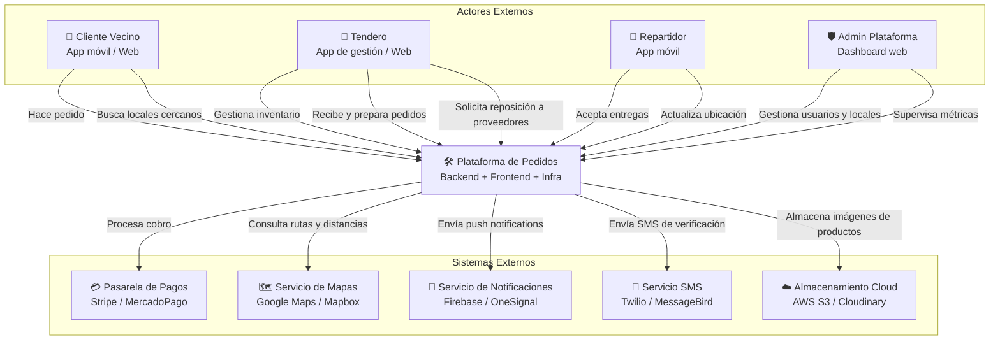
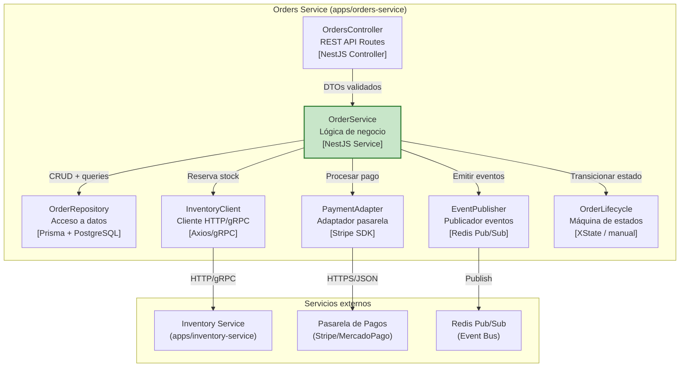
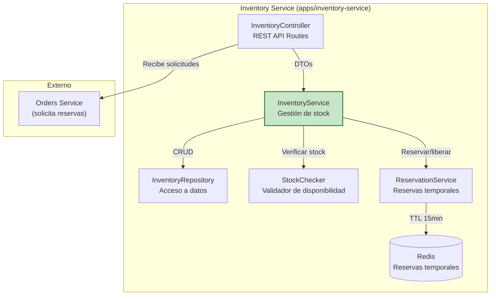
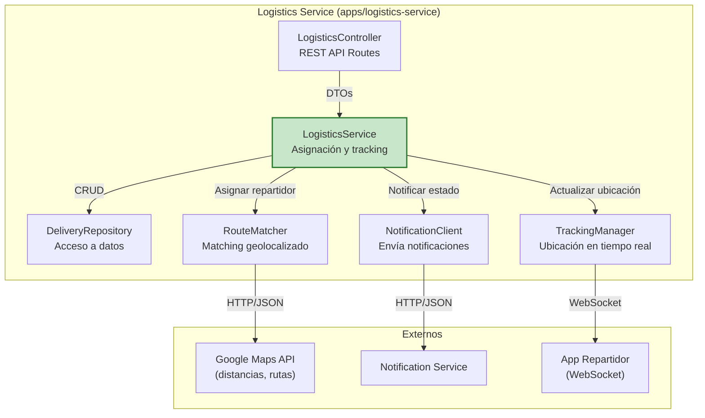
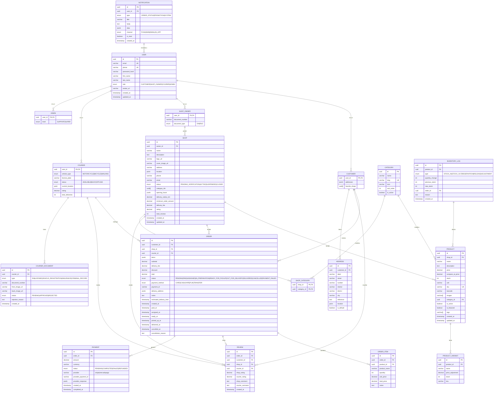

# Crear el archivo Markdown completo con la documentación C4 + Diagrama ER detallado
# para un sistema tipo Rappi enfocado en locales pequeños de barrio (bodegas, tienditas)

content = """# Documentación Técnica C4 — Sistema de Pedidos para Locales de Barrio
## (Plataforma tipo Rappi para bodegas, tienditas y comercios pequeños)

> **Estándar:** C4 Model (Simon Brown)  
> **Arquitectura:** Microservicios en monorepo (pnpm workspaces)  
> **Stack sugerido:** Node.js/TypeScript, PostgreSQL, Redis, Docker  
> **Audiencia:** Desarrolladores actuales y futuros del equipo

---

## 1. Alcance del MVP (Producto Mínimo Viable)

### Objetivos claros para el MVP

| Funcionalidad | Prioridad | Descripción |
|--------------|-----------|-------------|
| Registro de locales (tenderos) | Alta | Onboarding de bodegas/tienditas con validación de documentos |
| Catálogo de productos por local | Alta | CRUD de productos con stock, precios y categorías |
| App de clientes (pedidos) | Alta | Búsqueda de locales, carrito, checkout, tracking |
| Asignación de repartidores | Alta | Matching geolocalizado cliente-repartidor-local |
| Pasarela de pagos | Alta | Integración con Stripe/MercadoPago (tarjeta + efectivo) |
| Panel de administración | Media | Dashboard para tenderos: pedidos, inventario, reportes |
| Notificaciones push | Media | Estado del pedido en tiempo real |
| Sistema de reseñas | Baja | Calificación de locales y repartidores |

### Actores del sistema (específicos para barrio)

- **Cliente vecino:** Persona que compra en locales cercanos (radio 2-3 km)
- **Tendero (Dueño de bodega/tiendita):** Gestiona inventario, recibe pedidos, prepara órdenes
- **Repartidor (Motociclista/ciclista):** Recoge en local y entrega al cliente
- **Administrador de plataforma:** Supervisa operaciones, valida locales, gestiona conflictos

---

## 2. Nivel 1 — Contexto (Context Diagram)

### Descripción
El sistema conecta a vecinos con tenderos de barrio mediante una plataforma digital, gestionando pedidos, pagos y logística de entrega en un radio corto (2-3 km).



### Relaciones clave

| Actor | Interacción | Protocolo/Datos |
|-------|------------|----------------|
| Cliente | Realiza pedido | HTTPS/JSON (REST) |
| Tendero | Gestiona catálogo | HTTPS/JSON (REST) |
| Repartidor | Actualiza estado | WebSocket + HTTPS |
| Pasarela | Procesa pago | HTTPS/JSON (API REST) |
| Maps | Calcula rutas | HTTPS/JSON (API REST) |
| Notificaciones | Push estado | HTTPS/JSON (API REST) |

---

## 3. Nivel 2 — Contenedores (Container Diagram)

### Mapeo al monorepo

| Contenedor | Tipo | Tecnología | Ubicación en monorepo |
|------------|------|-----------|----------------------|
| API Gateway | App | Node.js / Fastify | `apps/api-gateway` |
| Auth Service | App | Node.js / Express + JWT | `apps/auth-service` |
| Orders Service | App | Node.js / NestJS | `apps/orders-service` |
| Inventory Service | App | Node.js / NestJS | `apps/inventory-service` |
| Logistics Service | App | Node.js / NestJS | `apps/logistics-service` |
| Notification Service | App | Node.js / Bull + Redis | `apps/notification-service` |
| Web App (Clientes) | App | React / Next.js | `apps/web-client` |
| Mobile App (Clientes) | App | React Native | `apps/mobile-client` |
| Tendero Dashboard | App | React / Next.js | `apps/tendero-dashboard` |
| Repartidor App | App | React Native | `apps/repartidor-app` |
| Admin Dashboard | App | React / Next.js | `apps/admin-dashboard` |
| Common Models | Package | TypeScript | `packages/common/models` |
| Common Utils | Package | TypeScript | `packages/common/utils` |
| Common DB | Package | TypeScript + Prisma | `packages/common/db` |
| PostgreSQL | DB | PostgreSQL 15 | Infra (Docker) |
| Redis | DB | Redis 7 | Infra (Docker) |

```mermaid
graph TB
    subgraph "Frontend / Clientes"
        WebClient["🌐 Web App Clientes<br/>Next.js<br/>(apps/web-client)"]
        MobileClient["📱 App Clientes<br/>React Native<br/>(apps/mobile-client)"]
        TenderoDash["🏪 Dashboard Tendero<br/>Next.js<br/>(apps/tendero-dashboard)"]
        RepartidorApp["🛵 App Repartidor<br/>React Native<br/>(apps/repartidor-app)"]
        AdminDash["🛡️ Admin Dashboard<br/>Next.js<br/>(apps/admin-dashboard)"]
    end

    subgraph "Backend / API"
        APIG["🚪 API Gateway<br/>Fastify<br/>(apps/api-gateway)"]
        Auth["🔐 Auth Service<br/>Express + JWT<br/>(apps/auth-service)"]
        Orders["📦 Orders Service<br/>NestJS<br/>(apps/orders-service)"]
        Inventory["📋 Inventory Service<br/>NestJS<br/>(apps/inventory-service)"]
        Logistics["🚚 Logistics Service<br/>NestJS<br/>(apps/logistics-service)"]
        Notifications["📲 Notification Service<br/>Bull + Redis<br/>(apps/notification-service)"]
    end

    subgraph "Packages Compartidos"
        CommonModels["📦 @common/models<br/>(packages/common/models)"]
        CommonDB["📦 @common/db<br/>(packages/common/db)"]
        CommonUtils["📦 @common/utils<br/>(packages/common/utils)"]
    end

    subgraph "Infraestructura de Datos"
        Postgres[("🐘 PostgreSQL 15<br/>Datos principales")]
        RedisCache[("⚡ Redis<br/>Cache + Sesiones")]
        RedisQueue[("⚡ Redis<br/>Colas de trabajos")]
    end

    subgraph "Servicios Externos"
        PasarelaExt["💳 Pasarela Pagos<br/>Stripe/MercadoPago"]
        MapsExt["🗺️ Mapas<br/>Google Maps"]
        PushExt["📲 Push Notifications<br/>Firebase FCM"]
        SMSExt["📧 SMS<br/>Twilio"]
        S3Ext["☁️ Cloud Storage<br/>AWS S3"]
    end

    WebClient -->|"HTTPS/JSON"| APIG
    MobileClient -->|"HTTPS/JSON"| APIG
    TenderoDash -->|"HTTPS/JSON"| APIG
    RepartidorApp -->|"HTTPS/JSON + WebSocket"| APIG
    AdminDash -->|"HTTPS/JSON"| APIG

    APIG -->|"Auth/Token"| Auth
    APIG -->|"Pedidos"| Orders
    APIG -->|"Inventario"| Inventory
    APIG -->|"Logística"| Logistics
    APIG -->|"Notificaciones"| Notifications

    Orders -->|"gRPC/HTTP"| Inventory
    Orders -->|"gRPC/HTTP"| Logistics
    Orders -->|"HTTP/JSON"| PasarelaExt
    Logistics -->|"HTTP/JSON"| MapsExt
    Notifications -->|"HTTP/JSON"| PushExt
    Notifications -->|"HTTP/JSON"| SMSExt

    Orders -->|"Prisma"| Postgres
    Inventory -->|"Prisma"| Postgres
    Logistics -->|"Prisma"| Postgres
    Auth -->|"Prisma"| Postgres

    Orders -->|"Redis"| RedisCache
    Auth -->|"Redis"| RedisCache
    Notifications -->|"Bull"| RedisQueue

    Orders -->|"Importa"| CommonModels
    Inventory -->|"Importa"| CommonModels
    Logistics -->|"Importa"| CommonModels
    Auth -->|"Importa"| CommonModels
    Orders -->|"Importa"| CommonDB
    Inventory -->|"Importa"| CommonDB
    Logistics -->|"Importa"| CommonDB
    Auth -->|"Importa"| CommonDB

    Inventory -->|"Imágenes productos"| S3Ext

    style Postgres fill:#e1f5fe,stroke:#01579b,stroke-width:2px
    style RedisCache fill:#fff3e0,stroke:#e65100,stroke-width:2px
    style RedisQueue fill:#fff3e0,stroke:#e65100,stroke-width:2px
```



---

## 4. Nivel 3 — Componentes (Component Diagrams)

### 4.1 Orders Service — Componentes internos



### 4.2 Inventory Service — Componentes internos



### 4.3 Logistics Service — Componentes internos



---

## 5. Nivel 4 — Código (Code Examples)

### 5.1 OrderService.ts — Implementación completa

```typescript
// apps/orders-service/src/services/OrderService.ts
import { Injectable, NotFoundException, BadRequestException } from '@nestjs/common';
import { PrismaService } from '@common/db';
import { Order, OrderStatus, CreateOrderDto, OrderItem } from '@common/models';
import { InventoryClient } from '../clients/InventoryClient';
import { PaymentAdapter } from '../adapters/PaymentAdapter';
import { EventPublisher } from '../events/EventPublisher';
import { OrderLifecycle } from './OrderLifecycle';

@Injectable()
export class OrderService {
    constructor(
        private readonly prisma: PrismaService,
        private readonly inventory: InventoryClient,
        private readonly payment: PaymentAdapter,
        private readonly events: EventPublisher,
        private readonly lifecycle: OrderLifecycle,
    ) {}

    async createOrder(dto: CreateOrderDto): Promise<Order> {
        // 1. Validar stock en inventory-service
        const stockAvailable = await this.inventory.checkStock(dto.items);
        if (!stockAvailable) {
            throw new BadRequestException('Stock insuficiente para algunos productos');
        }

        // 2. Reservar stock temporalmente (15 min TTL)
        await this.inventory.reserve(dto.items);

        // 3. Calcular totales
        const subtotal = dto.items.reduce((sum, item) => sum + (item.price * item.quantity), 0);
        const deliveryFee = this.calculateDeliveryFee(dto.deliveryAddress);
        const total = subtotal + deliveryFee;

        // 4. Crear orden en estado PENDING
        const order = await this.prisma.order.create({
            data: {
                customerId: dto.customerId,
                shopId: dto.shopId,
                items: dto.items as any,
                subtotal,
                deliveryFee,
                total,
                status: 'PENDING',
                deliveryAddress: dto.deliveryAddress,
                paymentMethod: dto.paymentMethod,
                notes: dto.notes,
            },
        });

        // 5. Publicar evento: order.created
        await this.events.publish('order.created', {
            orderId: order.id,
            shopId: order.shopId,
            customerId: order.customerId,
            total: order.total,
        });

        return order as Order;
    }

    async processPayment(orderId: string, paymentData: any): Promise<Order> {
        const order = await this.prisma.order.findUnique({ where: { id: orderId } });
        if (!order) throw new NotFoundException('Orden no encontrada');
        if (order.status !== 'PENDING') throw new BadRequestException('La orden no está pendiente');

        // Procesar pago con pasarela externa
        const paymentResult = await this.payment.charge({
            amount: order.total,
            currency: 'PEN', // Soles peruanos
            ...paymentData,
        });

        if (paymentResult.success) {
            // Confirmar reserva de stock permanentemente
            await this.inventory.confirmReservation(orderId);
            
            const updated = await this.prisma.order.update({
                where: { id: orderId },
                data: { 
                    status: 'PAID',
                    paymentId: paymentResult.id,
                    paidAt: new Date(),
                },
            });

            await this.events.publish('order.paid', { orderId, shopId: order.shopId });
            return updated as Order;
        } else {
            // Liberar reserva de stock
            await this.inventory.releaseReservation(orderId);
            
            await this.prisma.order.update({
                where: { id: orderId },
                data: { status: 'PAYMENT_FAILED' },
            });

            throw new BadRequestException('Pago rechazado: ' + paymentResult.message);
        }
    }

    async assignDelivery(orderId: string, courierId: string): Promise<Order> {
        const order = await this.prisma.order.findUnique({ where: { id: orderId } });
        if (!order) throw new NotFoundException('Orden no encontrada');
        if (order.status !== 'PAID') throw new BadRequestException('La orden no está pagada');

        const updated = await this.prisma.order.update({
            where: { id: orderId },
            data: { 
                status: 'ASSIGNED',
                courierId,
                assignedAt: new Date(),
            },
        });

        await this.events.publish('order.assigned', { orderId, courierId, shopId: order.shopId });
        return updated as Order;
    }

    async cancelOrder(orderId: string, reason: string): Promise<Order> {
        const order = await this.prisma.order.findUnique({ 
            where: { id: orderId },
            include: { items: true }
        });
        if (!order) throw new NotFoundException('Orden no encontrada');
        
        if (!['PENDING', 'PAID'].includes(order.status)) {
            throw new BadRequestException('No se puede cancelar una orden en estado: ' + order.status);
        }

        // Liberar stock reservado
        await this.inventory.releaseReservation(orderId);

        // Reembolsar si ya fue pagada
        if (order.status === 'PAID' && order.paymentId) {
            await this.payment.refund(order.paymentId);
        }

        const updated = await this.prisma.order.update({
            where: { id: orderId },
            data: { 
                status: 'CANCELLED',
                cancelledAt: new Date(),
                cancellationReason: reason,
            },
        });

        await this.events.publish('order.cancelled', { orderId, reason });
        return updated as Order;
    }

    private calculateDeliveryFee(address: any): number {
        // Lógica de cálculo basada en distancia
        // Para barrio: tarifa fija por distancia corta
        const baseFee = 3.50; // S/ 3.50 base
        const distanceKm = address.distance || 1;
        return baseFee + (distanceKm > 2 ? (distanceKm - 2) * 1.5 : 0);
    }
}
```

### 5.2 Modelos compartidos (@common/models)

```typescript
// packages/common/models/src/index.ts

// ─── Enums ───
export type OrderStatus = 
    | 'PENDING' 
    | 'PAID' 
    | 'ASSIGNED' 
    | 'IN_PREPARATION'
    | 'READY_FOR_PICKUP'
    | 'OUT_FOR_DELIVERY'
    | 'DELIVERED'
    | 'CANCELLED'
    | 'PAYMENT_FAILED';

export type PaymentMethod = 'CARD' | 'CASH' | 'YAPE' | 'PLIN' | 'TRANSFER';

export type UserRole = 'CUSTOMER' | 'SHOP_OWNER' | 'COURIER' | 'ADMIN';

export type CourierStatus = 'AVAILABLE' | 'BUSY' | 'OFFLINE';

export type ShopStatus = 'PENDING_VERIFICATION' | 'ACTIVE' | 'SUSPENDED' | 'CLOSED';

// ─── Entidades principales ───
export interface User {
    id: string;
    email: string;
    phone: string;
    passwordHash: string;
    firstName: string;
    lastName: string;
    role: UserRole;
    avatarUrl?: string;
    createdAt: Date;
    updatedAt: Date;
}

export interface Customer extends User {
    role: 'CUSTOMER';
    addresses: DeliveryAddress[];
    favoriteShops: string[]; // shop IDs
}

export interface ShopOwner extends User {
    role: 'SHOP_OWNER';
    documentNumber: string; // DNI/RUC
    documentType: 'DNI' | 'RUC';
    shops: Shop[];
}

export interface Courier extends User {
    role: 'COURIER';
    vehicleType: 'MOTORCYCLE' | 'BICYCLE' | 'WALKING';
    licensePlate?: string;
    status: CourierStatus;
    currentLocation?: GeoPoint;
    rating: number;
    totalDeliveries: number;
}

export interface Shop {
    id: string;
    ownerId: string;
    name: string;
    description?: string;
    logoUrl?: string;
    coverImageUrl?: string;
    address: string;
    location: GeoPoint;
    phone: string;
    email?: string;
    status: ShopStatus;
    categories: string[];
    openingHours: OpeningHours;
    deliveryRadiusKm: number;
    minimumOrderAmount: number;
    deliveryFee: number;
    rating: number;
    totalReviews: number;
    createdAt: Date;
    updatedAt: Date;
}

export interface Product {
    id: string;
    shopId: string;
    name: string;
    description?: string;
    price: number;
    compareAtPrice?: number;
    stock: number;
    unit: string; // 'unidad', 'kg', 'litro', 'docena'
    sku?: string;
    barcode?: string;
    images: string[];
    categoryId: string;
    isActive: boolean;
    isFeatured: boolean;
    tags: string[];
    createdAt: Date;
    updatedAt: Date;
}

export interface Order {
    id: string;
    customerId: string;
    shopId: string;
    courierId?: string;
    items: OrderItem[];
    subtotal: number;
    deliveryFee: number;
    discount?: number;
    total: number;
    status: OrderStatus;
    paymentMethod: PaymentMethod;
    paymentId?: string;
    deliveryAddress: DeliveryAddress;
    notes?: string;
    estimatedDeliveryTime?: Date;
    createdAt: Date;
    paidAt?: Date;
    assignedAt?: Date;
    readyAt?: Date;
    pickedUpAt?: Date;
    deliveredAt?: Date;
    cancelledAt?: Date;
    cancellationReason?: string;
}

export interface OrderItem {
    productId: string;
    productName: string;
    quantity: number;
    unitPrice: number;
    totalPrice: number;
    notes?: string;
}

export interface DeliveryAddress {
    id?: string;
    label: string; // 'Casa', 'Trabajo', 'Otro'
    street: string;
    number: string;
    interior?: string;
    district: string;
    city: string;
    reference?: string;
    location: GeoPoint;
}

export interface GeoPoint {
    latitude: number;
    longitude: number;
}

export interface OpeningHours {
    monday?: DaySchedule;
    tuesday?: DaySchedule;
    wednesday?: DaySchedule;
    thursday?: DaySchedule;
    friday?: DaySchedule;
    saturday?: DaySchedule;
    sunday?: DaySchedule;
}

export interface DaySchedule {
    open: string; // "08:00"
    close: string; // "22:00"
    isClosed: boolean;
}

export interface Review {
    id: string;
    orderId: string;
    customerId: string;
    shopId: string;
    courierId?: string;
    shopRating: number;
    courierRating?: number;
    shopComment?: string;
    courierComment?: string;
    createdAt: Date;
}

// ─── DTOs ───
export interface CreateOrderDto {
    customerId: string;
    shopId: string;
    items: { productId: string; quantity: number; notes?: string }[];
    deliveryAddress: DeliveryAddress;
    paymentMethod: PaymentMethod;
    notes?: string;
}

export interface CreateShopDto {
    ownerId: string;
    name: string;
    address: string;
    location: GeoPoint;
    phone: string;
    categories: string[];
    openingHours: OpeningHours;
}

export interface CreateProductDto {
    shopId: string;
    name: string;
    price: number;
    stock: number;
    unit: string;
    categoryId: string;
    images?: string[];
}
```

---

## 6. Diagrama Entidad-Relación (ER) Detallado

### 6.1 Diagrama ER (Mermaid)



### 6.2 Esquema SQL (PostgreSQL)

```sql
-- ============================================================
-- ESQUEMA SQL COMPLETO: Sistema de Pedidos para Locales de Barrio
-- PostgreSQL 15+ con extensiones: uuid-ossp, postgis (para geolocalización)
-- ============================================================

-- Extensiones necesarias
CREATE EXTENSION IF NOT EXISTS "uuid-ossp";
CREATE EXTENSION IF NOT EXISTS "postgis";

-- ============================================================
-- 1. TABLA USUARIOS (Base para todos los roles)
-- ============================================================
CREATE TABLE users (
    id UUID PRIMARY KEY DEFAULT uuid_generate_v4(),
    email VARCHAR(255) NOT NULL UNIQUE,
    phone VARCHAR(20) NOT NULL UNIQUE,
    password_hash VARCHAR(255) NOT NULL,
    first_name VARCHAR(100) NOT NULL,
    last_name VARCHAR(100) NOT NULL,
    role VARCHAR(20) NOT NULL CHECK (role IN ('CUSTOMER', 'SHOP_OWNER', 'COURIER', 'ADMIN')),
    avatar_url VARCHAR(500),
    is_active BOOLEAN DEFAULT TRUE,
    email_verified BOOLEAN DEFAULT FALSE,
    phone_verified BOOLEAN DEFAULT FALSE,
    created_at TIMESTAMP WITH TIME ZONE DEFAULT NOW(),
    updated_at TIMESTAMP WITH TIME ZONE DEFAULT NOW()
);

CREATE INDEX idx_users_email ON users(email);
CREATE INDEX idx_users_phone ON users(phone);
CREATE INDEX idx_users_role ON users(role);

-- ============================================================
-- 2. TABLA CLIENTES
-- ============================================================
CREATE TABLE customers (
    user_id UUID PRIMARY KEY REFERENCES users(id) ON DELETE CASCADE,
    favorite_shops UUID[] DEFAULT '{}',
    created_at TIMESTAMP WITH TIME ZONE DEFAULT NOW()
);

-- ============================================================
-- 3. TABLA DIRECCIONES DE CLIENTES
-- ============================================================
CREATE TABLE addresses (
    id UUID PRIMARY KEY DEFAULT uuid_generate_v4(),
    customer_id UUID NOT NULL REFERENCES customers(user_id) ON DELETE CASCADE,
    label VARCHAR(50) NOT NULL DEFAULT 'Otro', -- 'Casa', 'Trabajo', 'Otro'
    street VARCHAR(255) NOT NULL,
    number VARCHAR(50) NOT NULL,
    interior VARCHAR(50),
    district VARCHAR(100) NOT NULL,
    city VARCHAR(100) NOT NULL DEFAULT 'Lima',
    reference TEXT,
    location GEOGRAPHY(POINT, 4326), -- PostGIS para geolocalización
    is_default BOOLEAN DEFAULT FALSE,
    created_at TIMESTAMP WITH TIME ZONE DEFAULT NOW()
);

CREATE INDEX idx_addresses_customer ON addresses(customer_id);
CREATE INDEX idx_addresses_location ON addresses USING GIST(location);

-- ============================================================
-- 4. TABLA TENDEROS (Dueños de locales)
-- ============================================================
CREATE TABLE shop_owners (
    user_id UUID PRIMARY KEY REFERENCES users(id) ON DELETE CASCADE,
    document_number VARCHAR(20) NOT NULL,
    document_type VARCHAR(10) NOT NULL CHECK (document_type IN ('DNI', 'RUC')),
    verification_status VARCHAR(20) DEFAULT 'PENDING' CHECK (verification_status IN ('PENDING', 'VERIFIED', 'REJECTED')),
    created_at TIMESTAMP WITH TIME ZONE DEFAULT NOW()
);

-- ============================================================
-- 5. TABLA REPARTIDORES
-- ============================================================
CREATE TABLE couriers (
    user_id UUID PRIMARY KEY REFERENCES users(id) ON DELETE CASCADE,
    vehicle_type VARCHAR(20) NOT NULL CHECK (vehicle_type IN ('MOTORCYCLE', 'BICYCLE', 'WALKING')),
    license_plate VARCHAR(20),
    status VARCHAR(20) DEFAULT 'OFFLINE' CHECK (status IN ('AVAILABLE', 'BUSY', 'OFFLINE')),
    current_location GEOGRAPHY(POINT, 4326),
    rating DECIMAL(2,1) DEFAULT 5.0 CHECK (rating >= 0 AND rating <= 5),
    total_deliveries INTEGER DEFAULT 0,
    balance DECIMAL(10,2) DEFAULT 0.00, -- Saldo a pagar al repartidor
    is_approved BOOLEAN DEFAULT FALSE,
    created_at TIMESTAMP WITH TIME ZONE DEFAULT NOW()
);

CREATE INDEX idx_couriers_status ON couriers(status);
CREATE INDEX idx_couriers_location ON couriers USING GIST(current_location);

-- ============================================================
-- 6. TABLA DOCUMENTOS DE REPARTIDOR
-- ============================================================
CREATE TABLE courier_documents (
    id UUID PRIMARY KEY DEFAULT uuid_generate_v4(),
    courier_id UUID NOT NULL REFERENCES couriers(user_id) ON DELETE CASCADE,
    document_type VARCHAR(30) NOT NULL CHECK (document_type IN ('DNI', 'LICENSE', 'VEHICLE_REGISTRATION', 'INSURANCE', 'CRIMINAL_RECORD')),
    document_number VARCHAR(50),
    front_image_url VARCHAR(500) NOT NULL,
    back_image_url VARCHAR(500),
    status VARCHAR(20) DEFAULT 'PENDING' CHECK (status IN ('PENDING', 'APPROVED', 'REJECTED')),
    rejection_reason TEXT,
    created_at TIMESTAMP WITH TIME ZONE DEFAULT NOW()
);

-- ============================================================
-- 7. TABLA ADMINISTRADORES
-- ============================================================
CREATE TABLE admins (
    user_id UUID PRIMARY KEY REFERENCES users(id) ON DELETE CASCADE,
    level VARCHAR(20) DEFAULT 'SUPPORT' CHECK (level IN ('SUPPORT', 'SUPER')),
    created_at TIMESTAMP WITH TIME ZONE DEFAULT NOW()
);

-- ============================================================
-- 8. TABLA CATEGORÍAS DE PRODUCTOS/LOCALES
-- ============================================================
CREATE TABLE categories (
    id UUID PRIMARY KEY DEFAULT uuid_generate_v4(),
    name VARCHAR(100) NOT NULL,
    slug VARCHAR(100) NOT NULL UNIQUE,
    icon VARCHAR(100),
    sort_order INTEGER DEFAULT 0,
    is_active BOOLEAN DEFAULT TRUE,
    parent_id UUID REFERENCES categories(id), -- Para subcategorías
    created_at TIMESTAMP WITH TIME ZONE DEFAULT NOW()
);

CREATE INDEX idx_categories_slug ON categories(slug);
CREATE INDEX idx_categories_active ON categories(is_active);

-- ============================================================
-- 9. TABLA LOCALES (TIENDAS/BODEGAS)
-- ============================================================
CREATE TABLE shops (
    id UUID PRIMARY KEY DEFAULT uuid_generate_v4(),
    owner_id UUID NOT NULL REFERENCES shop_owners(user_id) ON DELETE CASCADE,
    name VARCHAR(200) NOT NULL,
    description TEXT,
    logo_url VARCHAR(500),
    cover_image_url VARCHAR(500),
    address VARCHAR(255) NOT NULL,
    location GEOGRAPHY(POINT, 4326) NOT NULL, -- PostGIS
    phone VARCHAR(20) NOT NULL,
    email VARCHAR(255),
    status VARCHAR(30) DEFAULT 'PENDING_VERIFICATION' 
        CHECK (status IN ('PENDING_VERIFICATION', 'ACTIVE', 'SUSPENDED', 'CLOSED')),
    opening_hours JSONB NOT NULL DEFAULT '{"monday":{"open":"08:00","close":"22:00","isClosed":false}}',
    delivery_radius_km DECIMAL(4,2) DEFAULT 2.00,
    minimum_order_amount DECIMAL(10,2) DEFAULT 10.00,
    delivery_fee DECIMAL(10,2) DEFAULT 3.50,
    rating DECIMAL(2,1) DEFAULT 5.0 CHECK (rating >= 0 AND rating <= 5),
    total_reviews INTEGER DEFAULT 0,
    commission_rate DECIMAL(4,2) DEFAULT 0.15, -- 15% comisión plataforma
    is_active BOOLEAN DEFAULT TRUE,
    created_at TIMESTAMP WITH TIME ZONE DEFAULT NOW(),
    updated_at TIMESTAMP WITH TIME ZONE DEFAULT NOW()
);

CREATE INDEX idx_shops_owner ON shops(owner_id);
CREATE INDEX idx_shops_status ON shops(status);
CREATE INDEX idx_shops_location ON shops USING GIST(location);
CREATE INDEX idx_shops_active ON shops(is_active, status);

-- ============================================================
-- 10. TABLA RELACIÓN LOCAL-CATEGORÍA
-- ============================================================
CREATE TABLE shop_categories (
    shop_id UUID NOT NULL REFERENCES shops(id) ON DELETE CASCADE,
    category_id UUID NOT NULL REFERENCES categories(id) ON DELETE CASCADE,
    PRIMARY KEY (shop_id, category_id)
);

-- ============================================================
-- 11. TABLA PRODUCTOS
-- ============================================================
CREATE TABLE products (
    id UUID PRIMARY KEY DEFAULT uuid_generate_v4(),
    shop_id UUID NOT NULL REFERENCES shops(id) ON DELETE CASCADE,
    name VARCHAR(200) NOT NULL,
    description TEXT,
    price DECIMAL(10,2) NOT NULL CHECK (price >= 0),
    compare_at_price DECIMAL(10,2) CHECK (compare_at_price >= 0),
    stock INTEGER NOT NULL DEFAULT 0 CHECK (stock >= 0),
    unit VARCHAR(20) NOT NULL DEFAULT 'unidad' CHECK (unit IN ('unidad', 'kg', 'litro', 'docena', 'gramo', 'ml')),
    sku VARCHAR(100),
    barcode VARCHAR(100),
    images VARCHAR(500)[] DEFAULT '{}',
    category_id UUID REFERENCES categories(id),
    is_active BOOLEAN DEFAULT TRUE,
    is_featured BOOLEAN DEFAULT FALSE,
    tags VARCHAR(50)[] DEFAULT '{}',
    weight_grams INTEGER, -- Para cálculo de envío
    created_at TIMESTAMP WITH TIME ZONE DEFAULT NOW(),
    updated_at TIMESTAMP WITH TIME ZONE DEFAULT NOW()
);

CREATE INDEX idx_products_shop ON products(shop_id);
CREATE INDEX idx_products_category ON products(category_id);
CREATE INDEX idx_products_active ON products(is_active);
CREATE INDEX idx_products_featured ON products(is_featured);
CREATE INDEX idx_products_price ON products(price);

-- ============================================================
-- 12. TABLA VARIANTES DE PRODUCTO (tamaños, sabores, etc.)
-- ============================================================
CREATE TABLE product_variants (
    id UUID PRIMARY KEY DEFAULT uuid_generate_v4(),
    product_id UUID NOT NULL REFERENCES products(id) ON DELETE CASCADE,
    name VARCHAR(100) NOT NULL, -- "Grande", "Chocolate", "Pack 6 unidades"
    price_adjustment DECIMAL(10,2) DEFAULT 0.00, -- Diferencia respecto al precio base
    stock INTEGER NOT NULL DEFAULT 0,
    sku VARCHAR(100),
    is_active BOOLEAN DEFAULT TRUE,
    created_at TIMESTAMP WITH TIME ZONE DEFAULT NOW()
);

-- ============================================================
-- 13. TABLA ÓRDENES (PEDIDOS)
-- ============================================================
CREATE TABLE orders (
    id UUID PRIMARY KEY DEFAULT uuid_generate_v4(),
    customer_id UUID NOT NULL REFERENCES customers(user_id),
    shop_id UUID NOT NULL REFERENCES shops(id),
    courier_id UUID REFERENCES couriers(user_id),
    items JSONB NOT NULL DEFAULT '[]', -- Array de OrderItem serializado
    subtotal DECIMAL(10,2) NOT NULL CHECK (subtotal >= 0),
    delivery_fee DECIMAL(10,2) NOT NULL DEFAULT 0.00,
    discount DECIMAL(10,2) DEFAULT 0.00,
    total DECIMAL(10,2) NOT NULL CHECK (total >= 0),
    status VARCHAR(30) NOT NULL DEFAULT 'PENDING' 
        CHECK (status IN ('PENDING', 'PAID', 'ASSIGNED', 'IN_PREPARATION', 'READY_FOR_PICKUP', 
                         'OUT_FOR_DELIVERY', 'DELIVERED', 'CANCELLED', 'PAYMENT_FAILED')),
    payment_method VARCHAR(20) NOT NULL CHECK (payment_method IN ('CARD', 'CASH', 'YAPE', 'PLIN', 'TRANSFER')),
    payment_id VARCHAR(255), -- ID de transacción en pasarela
    delivery_address JSONB NOT NULL,
    notes TEXT,
    estimated_delivery_time TIMESTAMP WITH TIME ZONE,
    created_at TIMESTAMP WITH TIME ZONE DEFAULT NOW(),
    paid_at TIMESTAMP WITH TIME ZONE,
    assigned_at TIMESTAMP WITH TIME ZONE,
    ready_at TIMESTAMP WITH TIME ZONE,
    picked_up_at TIMESTAMP WITH TIME ZONE,
    delivered_at TIMESTAMP WITH TIME ZONE,
    cancelled_at TIMESTAMP WITH TIME ZONE,
    cancellation_reason TEXT,
    cancellation_by UUID REFERENCES users(id), -- Quién canceló
    
    CONSTRAINT valid_timeline CHECK (
        (paid_at IS NULL OR paid_at >= created_at) AND
        (assigned_at IS NULL OR assigned_at >= paid_at) AND
        (ready_at IS NULL OR ready_at >= assigned_at) AND
        (picked_up_at IS NULL OR picked_up_at >= ready_at) AND
        (delivered_at IS NULL OR delivered_at >= picked_up_at)
    )
);

CREATE INDEX idx_orders_customer ON orders(customer_id);
CREATE INDEX idx_orders_shop ON orders(shop_id);
CREATE INDEX idx_orders_courier ON orders(courier_id);
CREATE INDEX idx_orders_status ON orders(status);
CREATE INDEX idx_orders_created ON orders(created_at);
CREATE INDEX idx_orders_payment ON orders(payment_id);

-- ============================================================
-- 14. TABLA ITEMS DE ORDEN (desnormalizado para performance, pero con referencia)
-- ============================================================
CREATE TABLE order_items (
    id UUID PRIMARY KEY DEFAULT uuid_generate_v4(),
    order_id UUID NOT NULL REFERENCES orders(id) ON DELETE CASCADE,
    product_id UUID NOT NULL REFERENCES products(id),
    product_name VARCHAR(200) NOT NULL,
    quantity INTEGER NOT NULL CHECK (quantity > 0),
    unit_price DECIMAL(10,2) NOT NULL,
    total_price DECIMAL(10,2) NOT NULL,
    variant_id UUID REFERENCES product_variants(id),
    notes TEXT,
    created_at TIMESTAMP WITH TIME ZONE DEFAULT NOW()
);

CREATE INDEX idx_order_items_order ON order_items(order_id);
CREATE INDEX idx_order_items_product ON order_items(product_id);

-- ============================================================
-- 15. TABLA PAGOS
-- ============================================================
CREATE TABLE payments (
    id UUID PRIMARY KEY DEFAULT uuid_generate_v4(),
    order_id UUID NOT NULL REFERENCES orders(id),
    amount DECIMAL(10,2) NOT NULL,
    currency VARCHAR(3) DEFAULT 'PEN',
    status VARCHAR(20) NOT NULL DEFAULT 'PENDING' CHECK (status IN ('PENDING', 'COMPLETED', 'FAILED', 'REFUNDED', 'PARTIALLY_REFUNDED')),
    provider VARCHAR(50) NOT NULL CHECK (provider IN ('stripe', 'mercadopago', 'yape', 'plin', 'manual')),
    provider_payment_id VARCHAR(255),
    provider_response JSONB,
    refunded_amount DECIMAL(10,2) DEFAULT 0.00,
    created_at TIMESTAMP WITH TIME ZONE DEFAULT NOW(),
    completed_at TIMESTAMP WITH TIME ZONE,
    refunded_at TIMESTAMP WITH TIME ZONE
);

CREATE INDEX idx_payments_order ON payments(order_id);
CREATE INDEX idx_payments_provider ON payments(provider_payment_id);

-- ============================================================
-- 16. TABLA RESEÑAS/CALIFICACIONES
-- ============================================================
CREATE TABLE reviews (
    id UUID PRIMARY KEY DEFAULT uuid_generate_v4(),
    order_id UUID NOT NULL UNIQUE REFERENCES orders(id),
    customer_id UUID NOT NULL REFERENCES customers(user_id),
    shop_id UUID NOT NULL REFERENCES shops(id),
    courier_id UUID REFERENCES couriers(user_id),
    shop_rating DECIMAL(2,1) NOT NULL CHECK (shop_rating >= 0 AND shop_rating <= 5),
    courier_rating DECIMAL(2,1) CHECK (courier_rating >= 0 AND courier_rating <= 5),
    shop_comment TEXT,
    courier_comment TEXT,
    shop_response TEXT, -- Respuesta del tendero
    is_visible BOOLEAN DEFAULT TRUE,
    created_at TIMESTAMP WITH TIME ZONE DEFAULT NOW()
);

CREATE INDEX idx_reviews_shop ON reviews(shop_id);
CREATE INDEX idx_reviews_courier ON reviews(courier_id);
CREATE INDEX idx_reviews_customer ON reviews(customer_id);

-- ============================================================
-- 17. TABLA LOG DE INVENTARIO (auditoría de stock)
-- ============================================================
CREATE TABLE inventory_logs (
    id UUID PRIMARY KEY DEFAULT uuid_generate_v4(),
    product_id UUID NOT NULL REFERENCES products(id),
    type VARCHAR(20) NOT NULL CHECK (type IN ('STOCK_IN', 'STOCK_OUT', 'RESERVATION', 'RELEASE', 'ADJUSTMENT', 'CANCEL')),
    quantity_change INTEGER NOT NULL,
    previous_stock INTEGER NOT NULL,
    new_stock INTEGER NOT NULL,
    order_id UUID REFERENCES orders(id),
    shop_id UUID NOT NULL REFERENCES shops(id),
    reason TEXT,
    created_by UUID REFERENCES users(id),
    created_at TIMESTAMP WITH TIME ZONE DEFAULT NOW()
);

CREATE INDEX idx_inventory_logs_product ON inventory_logs(product_id);
CREATE INDEX idx_inventory_logs_shop ON inventory_logs(shop_id);
CREATE INDEX idx_inventory_logs_order ON inventory_logs(order_id);

-- ============================================================
-- 18. TABLA NOTIFICACIONES
-- ============================================================
CREATE TABLE notifications (
    id UUID PRIMARY KEY DEFAULT uuid_generate_v4(),
    user_id UUID NOT NULL REFERENCES users(id) ON DELETE CASCADE,
    type VARCHAR(30) NOT NULL CHECK (type IN ('ORDER_STATUS', 'PROMOTION', 'SYSTEM', 'PAYMENT', 'DELIVERY')),
    title VARCHAR(200) NOT NULL,
    body TEXT NOT NULL,
    data JSONB, -- Payload adicional
    channel VARCHAR(20) NOT NULL CHECK (channel IN ('PUSH', 'SMS', 'EMAIL', 'IN_APP')),
    is_read BOOLEAN DEFAULT FALSE,
    read_at TIMESTAMP WITH TIME ZONE,
    sent_at TIMESTAMP WITH TIME ZONE,
    created_at TIMESTAMP WITH TIME ZONE DEFAULT NOW()
);

CREATE INDEX idx_notifications_user ON notifications(user_id);
CREATE INDEX idx_notifications_unread ON notifications(user_id, is_read);

-- ============================================================
-- 19. TABLA CONFIGURACIÓN DE PLATAFORMA
-- ============================================================
CREATE TABLE platform_settings (
    id UUID PRIMARY KEY DEFAULT uuid_generate_v4(),
    key VARCHAR(100) NOT NULL UNIQUE,
    value JSONB NOT NULL,
    description TEXT,
    updated_at TIMESTAMP WITH TIME ZONE DEFAULT NOW()
);

-- ============================================================
-- 20. TABLA ZONAS DE COBERTURA (para definir áreas de entrega)
-- ============================================================
CREATE TABLE coverage_zones (
    id UUID PRIMARY KEY DEFAULT uuid_generate_v4(),
    name VARCHAR(100) NOT NULL,
    district VARCHAR(100) NOT NULL,
    city VARCHAR(100) NOT NULL DEFAULT 'Lima',
    geometry GEOGRAPHY(POLYGON, 4326) NOT NULL, -- Área poligonal
    is_active BOOLEAN DEFAULT TRUE,
    delivery_fee DECIMAL(10,2) DEFAULT 3.50,
    minimum_order_amount DECIMAL(10,2) DEFAULT 10.00,
    created_at TIMESTAMP WITH TIME ZONE DEFAULT NOW()
);

CREATE INDEX idx_coverage_zones_geometry ON coverage_zones USING GIST(geometry);

-- ============================================================
-- 21. TABLA HISTORIAL DE UBICACIÓN DE REPARTIDORES
-- ============================================================
CREATE TABLE courier_location_history (
    id UUID PRIMARY KEY DEFAULT uuid_generate_v4(),
    courier_id UUID NOT NULL REFERENCES couriers(user_id),
    location GEOGRAPHY(POINT, 4326) NOT NULL,
    accuracy_meters INTEGER,
    speed_kmh DECIMAL(5,2),
    recorded_at TIMESTAMP WITH TIME ZONE DEFAULT NOW()
);

CREATE INDEX idx_courier_location_courier ON courier_location_history(courier_id);
CREATE INDEX idx_courier_location_time ON courier_location_history(recorded_at);

-- ============================================================
-- TRIGGERS Y FUNCIONES AUXILIARES
-- ============================================================

-- Actualizar updated_at automáticamente
CREATE OR REPLACE FUNCTION update_updated_at_column()
RETURNS TRIGGER AS $$
BEGIN
    NEW.updated_at = NOW();
    RETURN NEW;
END;
$$ language 'plpgsql';

CREATE TRIGGER update_users_updated_at BEFORE UPDATE ON users
    FOR EACH ROW EXECUTE FUNCTION update_updated_at_column();

CREATE TRIGGER update_shops_updated_at BEFORE UPDATE ON shops
    FOR EACH ROW EXECUTE FUNCTION update_updated_at_column();

CREATE TRIGGER update_products_updated_at BEFORE UPDATE ON products
    FOR EACH ROW EXECUTE FUNCTION update_updated_at_column();

-- Actualizar rating de shop cuando se inserta una review
CREATE OR REPLACE FUNCTION update_shop_rating()
RETURNS TRIGGER AS $$
BEGIN
    UPDATE shops 
    SET rating = (
        SELECT ROUND(AVG(shop_rating)::numeric, 1) 
        FROM reviews 
        WHERE shop_id = NEW.shop_id AND is_visible = TRUE
    ),
    total_reviews = (
        SELECT COUNT(*) 
        FROM reviews 
        WHERE shop_id = NEW.shop_id AND is_visible = TRUE
    )
    WHERE id = NEW.shop_id;
    RETURN NEW;
END;
$$ LANGUAGE plpgsql;

CREATE TRIGGER trigger_update_shop_rating 
    AFTER INSERT OR UPDATE ON reviews
    FOR EACH ROW EXECUTE FUNCTION update_shop_rating();

-- Actualizar rating de courier cuando se inserta una review
CREATE OR REPLACE FUNCTION update_courier_rating()
RETURNS TRIGGER AS $$
BEGIN
    IF NEW.courier_id IS NOT NULL THEN
        UPDATE couriers 
        SET rating = (
            SELECT ROUND(AVG(courier_rating)::numeric, 1) 
            FROM reviews 
            WHERE courier_id = NEW.courier_id AND is_visible = TRUE
        ),
        total_deliveries = (
            SELECT COUNT(*) 
            FROM orders 
            WHERE courier_id = NEW.courier_id AND status = 'DELIVERED'
        )
        WHERE user_id = NEW.courier_id;
    END IF;
    RETURN NEW;
END;
$$ LANGUAGE plpgsql;

CREATE TRIGGER trigger_update_courier_rating 
    AFTER INSERT OR UPDATE ON reviews
    FOR EACH ROW EXECUTE FUNCTION update_courier_rating();

-- ============================================================
-- VISTAS ÚTILES
-- ============================================================

-- Vista de órdenes con información resumida
CREATE VIEW order_summary AS
SELECT 
    o.id,
    o.status,
    o.total,
    o.payment_method,
    o.created_at,
    u.first_name || ' ' || u.last_name as customer_name,
    u.phone as customer_phone,
    s.name as shop_name,
    s.phone as shop_phone,
    c.first_name || ' ' || c.last_name as courier_name
FROM orders o
JOIN users u ON o.customer_id = u.id
JOIN shops s ON o.shop_id = s.id
LEFT JOIN users c ON o.courier_id = c.id;

-- Vista de productos con stock bajo (alerta)
CREATE VIEW low_stock_products AS
SELECT 
    p.id,
    p.name,
    p.stock,
    p.unit,
    s.name as shop_name,
    s.phone as shop_phone
FROM products p
JOIN shops s ON p.shop_id = s.id
WHERE p.stock <= 5 AND p.is_active = TRUE;
```

---

## 7. Mapeo del Monorepo (Estructura de Carpetas)

```
rapi-barrio/
├── apps/
│   ├── api-gateway/              # Punto de entrada, routing, auth middleware
│   ├── auth-service/             # Login, registro, JWT, refresh tokens
│   ├── orders-service/           # Gestión de pedidos, checkout, pagos
│   ├── inventory-service/        # Stock, productos, categorías
│   ├── logistics-service/        # Repartidores, rutas, tracking
│   ├── notification-service/     # Push, SMS, email
│   ├── web-client/               # Next.js - App para clientes (web)
│   ├── mobile-client/            # React Native - App para clientes
│   ├── tendero-dashboard/        # Next.js - Panel del tendero
│   ├── repartidor-app/           # React Native - App del repartidor
│   └── admin-dashboard/          # Next.js - Panel de administración
├── packages/
│   ├── common/
│   │   ├── models/               # Tipos, interfaces, enums (TypeScript)
│   │   ├── db/                   # Prisma schema + cliente
│   │   └── utils/                # Helpers, validadores, formatters
│   ├── config/
│   │   ├── eslint-config/        # Configuración compartida ESLint
│   │   └── tsconfig/             # Configuración compartida TypeScript
│   └── ui/                       # Componentes UI compartidos (React)
├── prisma/
│   └── schema.prisma             # Schema único de Prisma (referencia)
├── docker/
│   ├── docker-compose.yml        # Postgres, Redis, servicios
│   └── Dockerfile.*              # Dockerfiles por servicio
├── docs/
│   ├── architecture/             # Diagramas C4 (Mermaid/PlantUML)
│   ├── api/                      # OpenAPI specs
│   └── adr/                      # Architecture Decision Records
├── scripts/
│   ├── seed.ts                   # Datos de prueba
│   └── migrate.sh                # Scripts de migración
├── .github/
│   └── workflows/                # CI/CD pipelines
├── pnpm-workspace.yaml
├── turbo.json                    # Turborepo config
├── package.json
└── README.md
```

---

## 8. Buenas Prácticas y Estándares

### 8.1 Convenciones de Código

| Aspecto | Convención |
|---------|-------------|
| Lenguaje | TypeScript estricto (`strict: true`) |
| Nomenclatura | PascalCase clases, camelCase variables/functions, SCREAMING_SNAKE_CASE enums |
| Endpoints REST | `/api/v1/{resource}` |
| Versionado APIs | URL path (`/v1/`, `/v2/`) |
| Commits | Conventional Commits (`feat:`, `fix:`, `docs:`, `refactor:`) |
| Branching | GitFlow simplificado: `main`, `develop`, `feature/*`, `hotfix/*` |

### 8.2 Seguridad

- **Autenticación:** JWT con refresh tokens rotativos, almacenados en Redis
- **Autorización:** RBAC (Role-Based Access Control) con guards de NestJS
- **Datos sensibles:** Variables de entorno en `.env`, nunca en código
- **Pagos:** PCI-DSS compliance via tokenización (Stripe Elements)
- **Geolocalización:** Datos de ubicación encriptados en reposo
- **Rate limiting:** 100 req/min por IP, 1000 req/min por usuario autenticado

### 8.3 Observabilidad

- **Logs:** Estructurados (JSON) con Winston/Pino, niveles: error, warn, info, debug
- **Métricas:** Prometheus + Grafana (latencia, throughput, errores)
- **Trazas:** OpenTelemetry + Jaeger para distributed tracing
- **Alertas:** PagerDuty/Slack para errores 5xx > 1% o latencia p95 > 500ms

### 8.4 Testing

```bash
# Estrategia de testing
pnpm test:unit        # Jest - Tests unitarios por servicio
pnpm test:integration # Jest + TestContainers - Tests de integración con DB
pnpm test:e2e         # Playwright/Cypress - Tests end-to-end
pnpm test:contract    # Pact - Consumer-driven contract tests
```

---

## 9. Pipeline CI/CD (GitHub Actions)

```yaml
# .github/workflows/ci.yml (resumen)
name: CI/CD Pipeline

on:
  push:
    branches: [main, develop]
  pull_request:
    branches: [main, develop]

jobs:
  lint-and-test:
    runs-on: ubuntu-latest
    steps:
      - uses: actions/checkout@v4
      - uses: pnpm/action-setup@v2
      - run: pnpm install
      - run: pnpm -w -r lint
      - run: pnpm -w -r test:unit
      - run: pnpm -w -r build
      
  integration-test:
    runs-on: ubuntu-latest
    services:
      postgres:
        image: postgres:15
        env:
          POSTGRES_PASSWORD: test
      redis:
        image: redis:7
    steps:
      - run: pnpm test:integration
      
  deploy-staging:
    needs: [lint-and-test, integration-test]
    if: github.ref == 'refs/heads/develop'
    steps:
      - run: docker build -t rapi-barrio/staging .
      - run: kubectl apply -f k8s/staging/
      
  deploy-production:
    needs: [lint-and-test, integration-test]
    if: github.ref == 'refs/heads/main'
    environment: production
    steps:
      - run: docker build -t rapi-barrio/production .
      - run: kubectl apply -f k8s/production/
```

---

## 10. Roadmap y Siguientes Pasos

### Fase 1: MVP (Semanas 1-8)
- [ ] Scaffold del monorepo con Turborepo + pnpm
- [ ] Setup PostgreSQL + Redis + Docker Compose
- [ ] Auth Service (registro/login con JWT)
- [ ] Inventory Service (CRUD productos, categorías)
- [ ] Orders Service (flujo básico de pedido)
- [ ] Web app para clientes (Next.js)
- [ ] Dashboard del tendero (Next.js)
- [ ] Integración pasarela de pagos (Stripe)
- [ ] App del repartidor (React Native - básica)

### Fase 2: Escalabilidad (Semanas 9-16)
- [ ] Logistics Service (matching repartidor-pedido)
- [ ] Notificaciones push en tiempo real
- [ ] Sistema de reseñas y ratings
- [ ] Panel de administración
- [ ] Optimización de rutas (algoritmo TSP simplificado)
- [ ] Cache distribuido (Redis Cluster)

### Fase 3: Crecimiento (Semanas 17-24)
- [ ] Analytics y reportes avanzados
- [ ] Programa de fidelización (puntos/cupones)
- [ ] Multi-ciudad (zonas de cobertura)
- [ ] API pública para integraciones
- [ ] App iOS nativa (SwiftUI)

---

## 11. Decisiones de Arquitectura (ADRs)

### ADR-001: Monorepo vs. Multirepo
**Decisión:** Monorepo con pnpm workspaces + Turborepo  
**Razón:** Código compartido (@common/*), atomic changes, CI/CD unificado, onboarding rápido para equipo pequeño.

### ADR-002: Microservicios vs. Monolito modular
**Decisión:** Microservicios con API Gateway  
**Razón:** Escalabilidad independiente por dominio (orders vs inventory), equipos autónomos, despliegue independiente.

### ADR-003: PostgreSQL vs. MongoDB
**Decisión:** PostgreSQL con PostGIS  
**Razón:** Datos altamente relacionales (órdenes, items, pagos), transacciones ACID, queries geoespaciales nativas para matching de repartidores.

### ADR-004: REST vs. gRPC interno
**Decisión:** REST para externo, gRPC opcional para interno (fase 2)  
**Razón:** Simplicidad inicial, gRPC para alto rendimiento en comunicación servicio-servicio cuando se necesite.

### ADR-005: React Native vs. Flutter
**Decisión:** React Native  
**Razón:** Reutilización de componentes con web (React), equipo familiarizado con React/TypeScript, hot reload rápido.

---

> **Documentación generada para:** Sistema de pedidos para locales de barrio  
> **Fecha:** Junio 2026  
> **Autor:** Ingeniero de Software Senior  
> **Licencia:** Uso interno - Equipo de desarrollo
"""

# Guardar el archivo
with open('/mnt/agents/output/documentacion_c4_rapi_barrio.md', 'w', encoding='utf-8') as f:
    f.write(content)

print("✅ Documentación C4 completa generada exitosamente")
print(f"📄 Archivo: documentacion_c4_rapi_barrio.md")
print(f"📊 Tamaño: {len(content):,} caracteres")
print(f"📐 Líneas: {len(content.splitlines()):,}")
